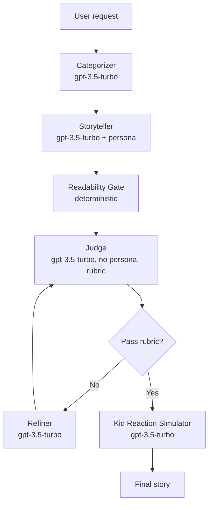

# Hippocratic AI Coding Assignment
Welcome to the [Hippocratic AI](https://www.hippocraticai.com) coding assignment

## Instructions
The attached code is a simple python script skeleton. Your goal is to take any simple bedtime story request and use prompting to tell a story appropriate for ages 5 to 10.
- Incorporate a LLM judge to improve the quality of the story
- Provide a block diagram of the system you create that illustrates the flow of the prompts and the interaction between judge, storyteller, user, and any other components you add
- Do not change the openAI model that is being used. 
- Please use your own openAI key, but do not include it in your final submission.
- Otherwise, you may change any code you like or add any files

---

## Rules
- This assignment is open-ended
- You may use any resources you like with the following restrictions
   - They must be resources that would be available to you if you worked here (so no other humans, no closed AIs, no unlicensed code, etc.)
   - Allowed resources include but not limited to Stack overflow, random blogs, chatGPT et al
   - You have to be able to explain how the code works, even if chatGPT wrote it
- DO NOT PUSH THE API KEY TO GITHUB. OpenAI will automatically delete it

---

## What does "tell a story" mean?
It should be appropriate for ages 5-10. Other than that it's up to you. Here are some ideas to help get the brain-juices flowing!
- Use story arcs to tell better stories
- Allow the user to provide feedback or request changes
- Categorize the request and use a tailored generation strategy for each category

---

## How will I be evaluated
Good question. We want to know the following:
- The efficacy of the system you design to create a good story
- Are you comfortable using and writing a python script
- What kinds of prompting strategies and agent design strategies do you use
- Are the stories your tool creates good?
- Can you understand and deconstruct a problem
- Can you operate in an open-ended environment
- Can you surprise us

---

## Other FAQs
- How long should I spend on this? 
No more than 2-3 hours
- Can I change what the input is? 
Sure
- How long should the story be?
You decide

---

## Project: Kid-Safe Bedtime Story Generator

This project implements a Self-Refine pipeline on `gpt-3.5-turbo` that turns a one-line bedtime request into an age-5-to-10 appropriate story. A category-routed storyteller (persona-conditioned) drafts the story, a deterministic readability gate filters obvious age-fit failures, a rubric-driven judge (no persona, G-Eval-style form-filling with constitutional safety principles) scores the draft on absolute scales, and either a refiner loops back to the judge or a kid-reaction simulator stress-tests the final story as a proxy audience.

## Architecture



| Component | Model call | Paper that justifies the design |
|---|---|---|
| Categorizer | `gpt-3.5-turbo` | arXiv:2303.17651 (Self-Refine task routing) |
| Storyteller | `gpt-3.5-turbo` + persona | arXiv:2305.14930 (persona on generator) |
| Readability Gate | deterministic (Flesch / age-band heuristics) | arXiv:2510.24250 (LLMs miscalibrate own age-fit) |
| Judge | `gpt-3.5-turbo`, no persona, rubric form-filling | arXiv:2303.16634 (G-Eval CoT) + arXiv:2212.08073 (Constitutional AI) |
| Refiner | `gpt-3.5-turbo` | arXiv:2303.17651 (Self-Refine, same-model loop) |
| Kid Reaction Simulator | `gpt-3.5-turbo` | arXiv:2305.14930 (persona as proxy audience, not judge) |

## How to run

```
python -m venv .venv
.\.venv\Scripts\activate    # Windows PowerShell:  .\.venv\Scripts\Activate.ps1
pip install -r requirements.txt
copy .env.example .env       # then paste your real OPENAI_API_KEY
python main.py               # text-only
python main.py --voice       # also synthesize an MP3 (output.mp3) via OpenAI TTS-1
```

## Voice / bedtime listening mode (Tier 1 extension)

Beyond the text-only pipeline, the `--voice` flag pipes the final story
through OpenAI's TTS-1 and writes an MP3. Why this is here, not gimmick: the
hiring product (Polaris) is voice-first; bedtime stories naturally *are* an
audio experience. Defaults are tuned for sleep — voice `shimmer` (soft,
intimate timbre), speed `0.9` (slightly slow), model `tts-1` (~$0.006 per
~400-word story). The OUTLINE block is stripped before synthesis; only the
STORY is read aloud. TTS failures degrade gracefully (warning, no crash).

Listen to the bundled samples in `examples/outputs/<category>.mp3` — these
were generated by `python examples/run_examples.py` and committed so reviewers
can compare voices without spending API credit. Override the voice with:

```
python main.py --voice --voice-name sage          # calmer, thoughtful
python examples/run_examples.py --voice nova       # brighter
python examples/run_examples.py --no-voice         # text only, save $0.04
```

Implementation note: pre-1.0 `openai` is pinned, so TTS is called via direct
`requests.post` to `/v1/audio/speech` — the audio.speech SDK namespace was
added in v1.x, and we did not want to bump the pin.

## Design rationale (cited)

- Self-Refine instead of multi-agent debate — same model only (arXiv:2303.17651, contrast 2308.07201)
- G-Eval CoT + form-filling judge (arXiv:2303.16634)
- Persona on storyteller, NOT on judge (arXiv:2305.14930, 2311.10054)
- Constitutional safety principles in judge prompt (arXiv:2212.08073)
- Deterministic readability gate (LLMs miscalibrate own age-fit — arXiv:2510.24250)
- Absolute scoring, no pairwise (arXiv:2406.07791)
- Kid Reaction Simulator as proxy audience, not quality judge (arXiv:2305.14930)

## Multi-agent specialist refiners (Tier 2 extension)

The original pipeline used a single generic refiner that received the
judge's `weakest` dimension and rewrote the whole story. Tier 2 replaces
that with a **constellation**: a dispatcher routes by `weakest` to one of
five narrowly-scoped specialist sub-agents, each focused on a single
rubric dimension:

| weakest | specialist | edit focus |
|---|---|---|
| `age_fit` | Vocabulary Simplifier | swap hard words, split long clauses, target FK ≤ 3.5 |
| `safety` | Safety Cleaner | rewrite borderline content against the constitution |
| `narrative_arc` | Beat Doctor | tighten the weak beat (setup / problem / resolution / wind-down) |
| `engagement` | Sensory Director | add sensory texture + ensure ≥1 line of dialogue |
| `calmness` | Pacing Soother | slow the back half, soften consonants, settling close |

Why this is here, not gimmick: it mirrors Hippocratic AI's published
**Polaris primary + specialist constellation** (arXiv:2403.13313). The
storyteller is the persona-bearing primary; specialists are persona-free
single-task editors (per arXiv:2311.10054 — personas degrade objective,
narrowly scoped tasks). Each specialist receives an `edit_log` of prior
specialists' touches and is told NOT to undo them — guards against the
ping-pong regression mode warned about in arXiv:2310.01798.

User free-text feedback ("make it sillier") doesn't map to any rubric
dimension, so it routes to the legacy generic refiner via a sentinel from
`dispatch()`. The trace layer (Tier 3) tags specialist calls
`specialist:<dim>` and the legacy refiner `refiner:generic`, so the
dashboard's per-role latency / cost breakdown surfaces which specialist
fired most often.

## Observability — eval traces & dashboard (Tier 3 extension)

Every pipeline run logs to a local SQLite file (`traces.db`, gitignored) via
`trace.py`. Each LLM call writes a row tagged with role (`categorizer`,
`storyteller`, `judge`, `json_fix`, `refiner`, `kid_reaction`), iteration,
latency, prompt/completion tokens, and a $-cost estimate using the
gpt-3.5-turbo-0125 pricing table. Each judge invocation also writes a
`judge_scores` row with all five rubric dimensions denormalized for cheap
SQL aggregation.

After running the pipeline a few times, inspect aggregate behavior with:

```
python -m evals report                       # full report from traces.db
python -m evals report --category ADVENTURE  # filter to one category
python -m evals report --db custom.db        # alternate DB path
```

Sample output:

```
# Story Pipeline Report
## Overview
- Runs: 20
- Errors: 0
- Mean iterations: 1.40
- Refinement rate (>=1 refine): 60.0%
- Pass rate (overall >= 4.0): 85.0%

## Per-call latency (seconds)
| role          |  n |  p50 |  p95 |
|---------------|---:|-----:|-----:|
| categorizer   | 20 | 0.42 | 0.71 |
| storyteller   | 20 | 3.81 | 5.92 |
| judge         | 28 | 2.14 | 3.40 |
| refiner       | 12 | 3.55 | 4.88 |
| kid_reaction  |  7 | 1.02 | 1.61 |

## Cost
- Total tokens: 184,210 in / 41,302 out
- Total cost: $0.1541 ($0.0077/run avg)

## Mean judge scores
- overall 4.18 | age_fit 4.20 | safety 4.85 | narrative_arc 3.95 | engagement 4.10 | calmness 4.00
```

Set `STORY_DB_PATH=""` to disable tracing entirely (the `record_*` functions
become no-ops). Tests automatically isolate to `tmp_path/trace_test.db` so
the project's `traces.db` is never touched by `pytest`.

Why SQLite + stdlib only, no Phoenix / Langfuse / LangSmith: the takehome is
a small runnable script, not a platform. Stdlib `sqlite3` keeps the deploy
surface tiny while still giving real, queryable traces.

## Repo files

- `main.py` — entrypoint wiring the Self-Refine pipeline (categorizer → storyteller → gate → judge → refiner/simulator)
- `prompts.py` — system + rubric prompts for each agent role
- `readability.py` — deterministic age-fit gate (Flesch / vocabulary / sentence-length checks)
- `requirements.txt` — pinned deps (`openai<1.0.0`, `python-dotenv>=1.0.0`)
- `.env.example` — template for `OPENAI_API_KEY`
- `IMPLEMENTATION_PLAN.md` — phased build plan and decisions log
- `sources.md` — full annotated paper list with arXiv IDs
- `briefing-doc.md` — one-page summary of the design and trade-offs

## Credits & sources

See `sources.md` for the full paper list and per-decision citations.
