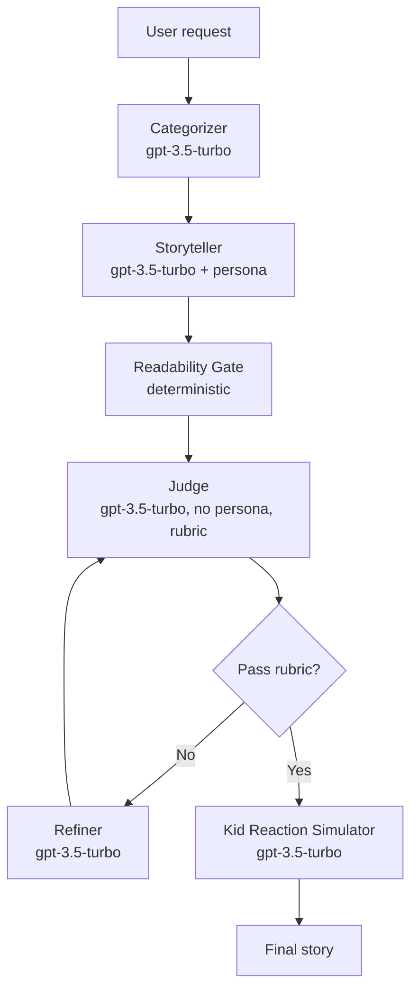

# Hippocratic AI Coding Assignment
Welcome to the [Hippocratic AI](https://www.hippocraticai.com) coding assignment

## Instructions
The attached code is a simple python script skeleton. Your goal is to take any simple bedtime story request and use prompting to tell a story appropriate for ages 5 to 10.
- Incorporate a LLM judge to improve the quality of the story
- Provide a block diagram of the system you create that illustrates the flow of the prompts and the interaction between judge, storyteller, user, and any other components you add
- Do not change the openAI model that is being used. 
- Please use your own openAI key, but do not include it in your final submission.
- Otherwise, you may change any code you like or add any files

---

## Rules
- This assignment is open-ended
- You may use any resources you like with the following restrictions
   - They must be resources that would be available to you if you worked here (so no other humans, no closed AIs, no unlicensed code, etc.)
   - Allowed resources include but not limited to Stack overflow, random blogs, chatGPT et al
   - You have to be able to explain how the code works, even if chatGPT wrote it
- DO NOT PUSH THE API KEY TO GITHUB. OpenAI will automatically delete it

---

## What does "tell a story" mean?
It should be appropriate for ages 5-10. Other than that it's up to you. Here are some ideas to help get the brain-juices flowing!
- Use story arcs to tell better stories
- Allow the user to provide feedback or request changes
- Categorize the request and use a tailored generation strategy for each category

---

## How will I be evaluated
Good question. We want to know the following:
- The efficacy of the system you design to create a good story
- Are you comfortable using and writing a python script
- What kinds of prompting strategies and agent design strategies do you use
- Are the stories your tool creates good?
- Can you understand and deconstruct a problem
- Can you operate in an open-ended environment
- Can you surprise us

---

## Other FAQs
- How long should I spend on this? 
No more than 2-3 hours
- Can I change what the input is? 
Sure
- How long should the story be?
You decide

---

## Project: Kid-Safe Bedtime Story Generator

This project implements a Self-Refine pipeline on `gpt-3.5-turbo` that turns a one-line bedtime request into an age-5-to-10 appropriate story. A category-routed storyteller (persona-conditioned) drafts the story, a deterministic readability gate filters obvious age-fit failures, a rubric-driven judge (no persona, G-Eval-style form-filling with constitutional safety principles) scores the draft on absolute scales, and either a refiner loops back to the judge or a kid-reaction simulator stress-tests the final story as a proxy audience.

## Architecture



| Component | Model call | Paper that justifies the design |
|---|---|---|
| Categorizer | `gpt-3.5-turbo` | arXiv:2303.17651 (Self-Refine task routing) |
| Storyteller | `gpt-3.5-turbo` + persona | arXiv:2305.14930 (persona on generator) |
| Readability Gate | deterministic (Flesch / age-band heuristics) | arXiv:2510.24250 (LLMs miscalibrate own age-fit) |
| Judge | `gpt-3.5-turbo`, no persona, rubric form-filling | arXiv:2303.16634 (G-Eval CoT) + arXiv:2212.08073 (Constitutional AI) |
| Refiner | `gpt-3.5-turbo` | arXiv:2303.17651 (Self-Refine, same-model loop) |
| Kid Reaction Simulator | `gpt-3.5-turbo` | arXiv:2305.14930 (persona as proxy audience, not judge) |

## How to run

```
python -m venv .venv
.\.venv\Scripts\activate    # Windows PowerShell:  .\.venv\Scripts\Activate.ps1
pip install -r requirements.txt
copy .env.example .env       # then paste your real OPENAI_API_KEY
python main.py
```

## Design rationale (cited)

- Self-Refine instead of multi-agent debate — same model only (arXiv:2303.17651, contrast 2308.07201)
- G-Eval CoT + form-filling judge (arXiv:2303.16634)
- Persona on storyteller, NOT on judge (arXiv:2305.14930, 2311.10054)
- Constitutional safety principles in judge prompt (arXiv:2212.08073)
- Deterministic readability gate (LLMs miscalibrate own age-fit — arXiv:2510.24250)
- Absolute scoring, no pairwise (arXiv:2406.07791)
- Kid Reaction Simulator as proxy audience, not quality judge (arXiv:2305.14930)

## Repo files

- `main.py` — entrypoint wiring the Self-Refine pipeline (categorizer → storyteller → gate → judge → refiner/simulator)
- `prompts.py` — system + rubric prompts for each agent role
- `readability.py` — deterministic age-fit gate (Flesch / vocabulary / sentence-length checks)
- `requirements.txt` — pinned deps (`openai<1.0.0`, `python-dotenv>=1.0.0`)
- `.env.example` — template for `OPENAI_API_KEY`
- `IMPLEMENTATION_PLAN.md` — phased build plan and decisions log
- `sources.md` — full annotated paper list with arXiv IDs
- `briefing-doc.md` — one-page summary of the design and trade-offs

## Credits & sources

See `sources.md` for the full paper list and per-decision citations.
